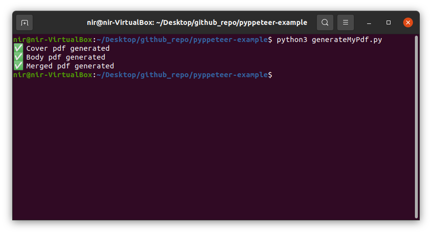

# Pyppeteer Research

## Goal
I want a system that can generate a pdf from url given with following points
- Add header & footer 
- page number
- generate diffrent pdfs from ulrs
- generate final pdf from diffrent generated pdfs

## Pyppeteer
I have used [Pyppeteer](https://github.com/pyppeteer/pyppeteer) which is Unofficial Python port of [Puppeteer](https://github.com/puppeteer/puppeteer) JavaScript (headless) chrome/chromium browser automation library.

## Installation 📥

Clone this repository 📁

Install [Pyppeteer](https://github.com/pyppeteer/pyppeteer)

```sh
pip install pyppeteer
```

Install [PyPDF2](https://pypi.org/project/PyPDF2/)

```sh
pip install PyPDF2
```

Try running following command

```sh
python3 generateMyPdf.py
```

This will generate three pdfs 1st cover page pdf, 2nd main body pdf, and 3rd merged pdf.



